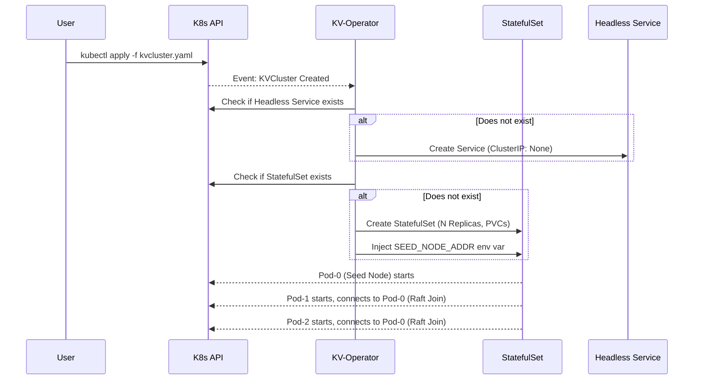

# KV-Operator: Distributed Database Controller


**KV-Operator** is a Kubernetes Operator built in Go using the [Kubebuilder](https://book.kubebuilder.io/) framework. It extends the Kubernetes API by introducing a `KVCluster` Custom Resource Definition (CRD), which completely automates the deployment and configuration of a distributed, Raft-based Key-Value store.

Managing stateful applications on Kubernetes is notoriously complex. This operator encodes the "Day 1" operational knowledge required to bootstrap a Raft consensus cluster into an automated software loop.

## ✨ Key Engineering Features

*   **Custom Resource Definition (CRD):** Extends the Kubernetes API, allowing users to define a database cluster declaratively (e.g., `size: 3`).
*   **Stateful Workload Management:** Automatically provisions `StatefulSets` to ensure ordered deployment, stable network identifiers, and sticky persistent storage (`PersistentVolumeClaims`) for the Write-Ahead Log (WAL) and Raft data.
*   **Automated Raft Bootstrapping:** Dynamically injects topology information into the pods. It sets `SEED_NODE_ID` and calculates the `SEED_NODE_ADDR` via a Headless Service so that replicas `1` to `N` automatically discover and join replica `0` to form a consensus quorum.
*   **Idempotent Reconciliation:** The controller continuously watches the cluster state. If a resource (Service, StatefulSet) is deleted or modified manually, the operator instantly reverts it back to the desired state.
*   **RBAC & Least Privilege:** Uses tightly scoped ServiceAccounts and ClusterRoles generated via Kubebuilder markers.

## 🏗 Architecture & Reconciliation Loop



## 🚀 Getting Started

### Prerequisites
*   Go 1.25+
*   Docker
*   `kubectl` & a running Kubernetes cluster (e.g., [Kind](https://kind.sigs.k8s.io/) or Minikube)

### 1. Install CRDs
Install the `KVCluster` Custom Resource Definition into your cluster:
```bash
make install
```

### 2. Run the Operator (Local Development)
You can run the operator process locally on your machine. It will connect to the cluster specified in your `~/.kube/config`:
```bash
make run
```
*(Keep this terminal open, and open a new one for the next steps)*

### 3. Deploy a Database Cluster
Create a file named `sample-cluster.yaml`:
```yaml
apiVersion: storage.mydatabase.io/v1alpha1
kind: KVCluster
metadata:
  name: my-raft-db
  namespace: default
spec:
  size: 3 # Number of nodes in the consensus group
```

Apply the Custom Resource:
```bash
kubectl apply -f sample-cluster.yaml
```

### 4. Verify the Deployment
Watch the operator automatically create the necessary resources:
```bash
# Check the custom resource
kubectl get kvclusters

# Check the StatefulSet and Pods
kubectl get statefulsets
kubectl get pods -l app=my-raft-db

# Check the Headless Service
kubectl get svc my-raft-db-service
```

## 🧠 Under the Hood: The "Magic" of the Operator

If you look at `internal/controller/kvcluster_controller.go`, you'll see how the operator bridges the gap between Kubernetes infrastructure and the application's internal Raft logic:

```go
Env: []corev1.EnvVar{
    { Name: "POD_NAME", ValueFrom: &corev1.EnvVarSource{...} },
    { Name: "NODE_ID", Value: "$(POD_NAME)" },
    { Name: "SEED_NODE_ID", Value: kvc.Name + "-0" },
    { Name: "SEED_NODE_ADDR", Value: fmt.Sprintf("%s-0.%s-service.%s.svc.cluster.local:50051", kvc.Name, kvc.Name, kvc.Namespace) },
}
```
Because StatefulSets guarantee predictable naming (`pod-0`, `pod-1`), the Operator knows exactly what the DNS record of the first node will be *before* it even exists. It injects this DNS record into all pods, allowing `pod-1` and `pod-2` to seamlessly join the cluster leader via gRPC.

## 🧹 Cleanup

To delete the database cluster and its data:
```bash
kubectl delete kvcluster my-raft-db
```
*(Note: Because of OwnerReferences, deleting the KVCluster automatically garbage-collects the StatefulSet and Service).*

To uninstall the CRD from the cluster:
```bash
make uninstall
```

## 📜 License

This project is licensed under the Apache License 2.0.